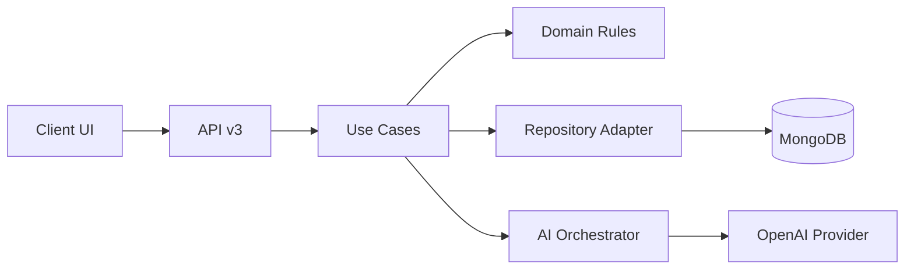

# Architecture Blueprint: Streaker AI V2.5/V3

Version: 0.1 (Design Only)
Status: Draft
Owner: Principal Engineer / Domain Architect

---

# 1. Purpose
This document defines the target architecture, domain model, API surface, module boundaries, migration plan, and risk register for Streaker AI V2.5/V3. It is grounded in the current codebase and intended to guide refactoring without implementation.

---

# 2. Conceptual Integrity Audit

## 2.1 Concept Drift (Duplicated or Incompatible)
- Board vs Panel as two primary persistence models.
  - `models/board.js`, `models/StreakerBoard.js` vs `models/Panel.js`.
- Cells and History are both used as state sources.
  - `models/Panel.js`, `utils/v2/savePanelToDb.js`, `components/v1/StreakerHistoryGrid.tsx`.
- Two API surfaces with different semantics.
  - `app/api/v1/*` vs `app/api/v2/*`.
- Streak computation and day validation exist in UI, not domain.
  - `components/StreakerGridItem.jsx`, `app/dashboard/page.jsx`.

## 2.2 Implicit Domain Language
- Streak, DayState, Goal, and History exist in UI logic but are not formalized in domain types.

## 2.3 Business Rules in UI
- Day validity and transitions are enforced in UI components.
  - `components/StreakerGridItem.jsx`.
- Streaks and hit rate computed per page.
  - `app/dashboard/page.jsx`, `app/history/dashboard/page.jsx`, `app/stats/page.jsx`.

---

# 3. Canonical Domain Schema (TypeScript)

```ts
export type ID = string;
export type ISODate = string; // YYYY-MM-DD

export interface User {
  id: ID;
  email: string;
  name?: string;
  avatarUrl?: string;
  createdAt: ISODate;
}

export interface Goal {
  id: ID;
  userId: ID;
  title: string;
  createdAt: ISODate;
  archivedAt?: ISODate;
}

export interface Habit {
  id: ID;
  goalId: ID;
  name: string;        // e.g., "Sleep"
  target: string;      // e.g., "8 hrs"
  order: number;
  active: boolean;
}

export interface DayState {
  date: ISODate;
  habitId: ID;
  status: "done" | "missed" | "unreviewed";
  note?: string;
  updatedAt: ISODate;
}

export interface Streak {
  habitId: ID;
  current: number;
  longest: number;
  lastCompletedDate?: ISODate;
}

export interface HistoryEvent {
  id: ID;
  userId: ID;
  type: "DAY_STATE_UPDATED" | "GOAL_UPDATED" | "HABIT_UPDATED";
  payload: Record<string, unknown>;
  createdAt: ISODate;
}

export interface AICoachSession {
  id: ID;
  userId: ID;
  goalId?: ID;
  prompt: string;
  response: string;
  model: string;
  createdAt: ISODate;
  tokensIn?: number;
  tokensOut?: number;
  latencyMs?: number;
}
```

---

# 4. Target Architecture (V2.5/V3)

## 4.1 Principles
- Single persistence model based on Goals, Habits, DayState, and HistoryEvent.
- Single API surface (`/api/v3/*`).
- AI layer as a service boundary with adapters.
- Event-sourced or append-only history.
- Deterministic streak computation in domain layer.

## 4.2 Module Boundaries
- **Domain**: Types, invariants, transitions, streak computation.
- **Application**: Use cases and orchestration.
- **Infrastructure**: Database, AI provider, auth provider.
- **Interface**: API routes and web UI.

## 4.3 Proposed Folder Structure
```
src/
  domain/
    types/
    rules/
    streaks/
  application/
    use-cases/
    ports/
  infrastructure/
    db/
    ai/
    auth/
  interface/
    api/
    web/
```

## 4.4 Responsibility Map
- Domain: DayState transitions, streak math, invariants.
- Application: Authorization, validation, orchestration.
- Infrastructure: Mongo adapter, OpenAI adapter, Kinde adapter.
- Interface: Next.js routes, UI rendering.

## 4.5 Data Flow (Target)


---

# 5. API Surface (V3)

## 5.1 Goals
- `POST /api/v3/goals`
- `GET /api/v3/goals`
- `PATCH /api/v3/goals/:id`

## 5.2 Habits
- `POST /api/v3/goals/:goalId/habits`
- `PATCH /api/v3/habits/:id`
- `GET /api/v3/goals/:goalId/habits`

## 5.3 DayState
- `POST /api/v3/day-states`
- `GET /api/v3/day-states?goalId&month=YYYY-MM`

## 5.4 History (Append-Only)
- `GET /api/v3/history?goalId`

## 5.5 AI Coach
- `POST /api/v3/ai/sessions`
- `GET /api/v3/ai/sessions?goalId`

---

# 6. Deterministic Streak Engine
- Input: DayState list per habit.
- Output: current streak, longest streak, hit rate.
- Logic moves from UI into domain.

---

# 7. Migration Strategy

## 7.1 Delete
- `models/board.js`
- `models/StreakerBoard.js`
- `app/api/v1/*`
- `prisma/schema.prisma` (if unused)

## 7.2 Freeze
- `components/v1/*`
- `app/board/*`

## 7.3 Refactor
- Move business logic from `components/*` to domain modules.
- Replace `utils/v2/savePanelToDb.js` with append-only history updates.

## 7.4 Rewrite
- Rebuild API surface under `/api/v3/*`.

## 7.5 Adapters
- Create V2 ? V3 adapter for interim compatibility.

---

# 8. Strangler Pattern Steps

1) Introduce V3 domain model and read endpoints.
2) Read from Panel but map into new types.
3) Write via v3 endpoints (dual-write to Panel + HistoryEvent).
4) Migrate UI to v3.
5) Decommission v1/v2.

---

# 9. Data Migration Outline

- Export panels from Mongo.
- Create Goal + Habit records.
- Generate DayState from panel.cells.
- Emit HistoryEvent for each update.
- Validate streak calculations against current UI results.

---

# 10. Risk Register

| Risk | Likelihood | Impact | Mitigation |
|------|------------|--------|------------|
| Data integrity drift (Board vs Panel) | High | High | Single model + migration |
| OpenAI key exposure | High | Critical | Server-only AI access |
| Unauth write endpoints | Medium | High | Auth on all writes |
| Schema drift in history | Medium | High | Append-only events |
| AI cost spikes | Medium | High | Quotas + caching |
| Vendor lock-in | Medium | Medium | Adapter interfaces |

---

# 11. AI-Native Opportunities

## 11.1 Training Signals
- DayState + streak gaps as features.
- Notes as behavioral context.

## 11.2 Habit Embeddings
- Embed habit names + notes.
- Cluster successful patterns.

## 11.3 Memory + Reflection Loops
- Daily reflection: missed vs done.
- Weekly summary: streak health.

## 11.4 Discipline Coach Evolution
- Assistant orchestrator grounded in event stream.

---

# 12. Refactor Milestones

## P0 (2–3 weeks)
- Remove client-side OpenAI key usage.
- Fix panel save flow and history consistency.
- Add v3 domain read endpoints.

## P1 (3–5 weeks)
- Add v3 write endpoints.
- Migrate UI to v3 endpoints.
- Introduce append-only history events.

## P2 (4–6 weeks)
- AI orchestration boundary.
- Deterministic streak engine.
- Full migration + delete legacy.

---

# 13. Open Questions
- Confirm single data store (Mongo) for V3.
- Decide on event retention policy.
- Confirm AI provider strategy (OpenAI only vs pluggable).

