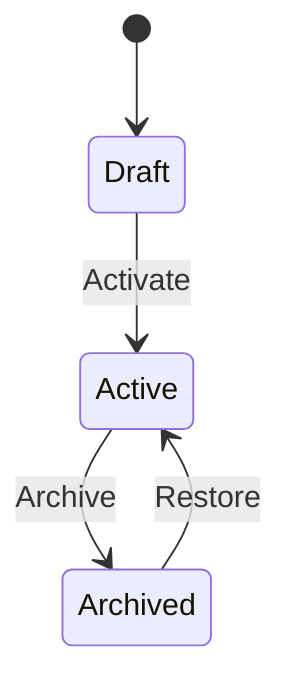
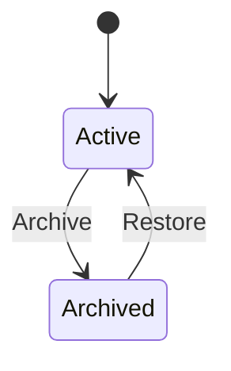

# Streaker AI Domain Constitution (V3)

Version: 1.0 (Design Only)
Status: Draft
Scope: Pure domain logic (no UI, API, or framework details)

---

# 1. Canonical Time Model

## 1.1 Timezone Authority
- Each User has a canonical timezone `user.tz` (IANA, e.g., `America/New_York`).
- All DayState records are normalized to `user.tz` at write time.

## 1.2 Definition of “Day”
- A Day is the closed-open interval `[00:00:00, 24:00:00)` in `user.tz`.
- Day identifier is `dateKey = YYYY-MM-DD` in `user.tz`.

## 1.3 Date Normalization
- Any timestamp `t` is mapped to `dateKey` by converting to `user.tz` and taking calendar date.
- Persisted DayState references only `dateKey` (no time of day).

## 1.4 Future Dates
- A DayState for `dateKey > today(user.tz)` is forbidden.
- Writes for future dates must be rejected.

## 1.5 Backdated Entries
- Backdating is allowed within a configurable window `BACKDATE_WINDOW_DAYS` (default: 7).
- Backdated writes older than window must be rejected.

## 1.6 Timezone Change and Travel
- Timezone change is recorded as a `USER_TIMEZONE_UPDATED` event.
- Historical DayState `dateKey` values are not re-mapped retroactively.
- All subsequent writes use the new timezone for date normalization.

---

# 2. Entity Lifecycles

## 2.1 Goal Lifecycle

### States
- `Draft` (optional)
- `Active`
- `Archived`

### Transitions
- `Create`: None ? Draft or Active
- `Rename`: Active ? Active
- `Archive`: Active ? Archived
- `Restore`: Archived ? Active

### Invariants
- A Goal is owned by exactly one User.
- Goal title is unique per user among Active goals.
- Archived Goals retain all history.
- Archiving freezes streak computation for its Habits (no new DayState allowed).

### State Diagram


---

## 2.2 Habit Lifecycle

### States
- `Active`
- `Archived`

### Transitions
- `Create`: None ? Active
- `Rename`: Active ? Active
- `Reorder`: Active ? Active
- `ChangeTarget`: Active ? Active
- `Archive`: Active ? Archived
- `Restore`: Archived ? Active

### Invariants
- A Habit belongs to exactly one Goal.
- A Habit cannot exist without its Goal.
- DayState may reference an Archived Habit (historical), but not a Deleted Habit (deletion forbidden).
- Archiving a Habit freezes its streaks as of the archive date.

### State Diagram


---

## 2.3 DayState Lifecycle (Core)

### Persisted vs Derived
- Persisted: user-declared state (`done` or `not_done`) and optional note.
- Derived: `missed` and `unreviewed` are computed, not persisted.

### Allowed Persisted States
- `done`
- `not_done`

### Derived States
- `unreviewed`: no DayState exists for that day/habit.
- `missed`: `not_done` exists for that day/habit.

### Notes
- Notes attach to DayState records and can be updated.

### Idempotency
- A DayState upsert with identical payload is a no-op.
- Upserts are keyed by `(habitId, dateKey)`.

### Transitions
- `unrecorded` ? `done`
- `unrecorded` ? `not_done`
- `done` ? `done` (note update)
- `not_done` ? `not_done` (note update)

### Forbidden Transitions
- `done` ? `not_done` (unless `ALLOW_REVERSAL` enabled)
- `not_done` ? `done` (unless `ALLOW_REVERSAL` enabled)
- Any ? future date

### Rules
- Future day writes are rejected.
- Past day edits are allowed only within `BACKDATE_WINDOW_DAYS`.
- If a Habit is Archived, DayState updates are rejected for dates >= archive date.

---

# 3. Formal Streak Definition

## 3.1 Definition
- A streak is a maximal contiguous run of `done` DayStates in `dateKey` order for a given Habit.

## 3.2 Current Streak
- Count of consecutive `done` days ending at the latest `dateKey <= today(user.tz)`.
- If latest day is not `done`, current streak is 0.

## 3.3 Longest Streak
- Maximum length of any contiguous `done` sequence over the Habit’s history.

## 3.4 Completion Ratio (Hit Rate)
- `doneCount / (doneCount + missedCount)` over a period.
- `missedCount` is the number of `not_done` DayStates.

## 3.5 Pseudocode

```ts
function computeStreaks(dayStates: DayState[], today: ISODate): Streak {
  const doneDates = dayStates
    .filter(s => s.status === "done")
    .map(s => s.date)
    .sort();

  let longest = 0;
  let current = 0;
  let lastDate: ISODate | null = null;

  for (const date of doneDates) {
    if (!lastDate || isNextDay(lastDate, date)) {
      current += 1;
    } else {
      longest = Math.max(longest, current);
      current = 1;
    }
    lastDate = date;
  }
  longest = Math.max(longest, current);

  const currentStreak = doneDates.includes(today)
    ? countBackwards(doneDates, today)
    : 0;

  return { habitId: dayStates[0]?.habitId || "", current: currentStreak, longest };
}
```

### Determinism Proof (Sketch)
- The streak function consumes only DayState events in canonical `dateKey` order.
- Given an identical ordered event stream, the DayState projection is identical.
- Therefore streaks computed from that projection are deterministic and replayable.

---

# 4. Event Sourcing Contract

## 4.1 Canonical Events
- `GOAL_CREATED`
- `GOAL_UPDATED`
- `GOAL_ARCHIVED`
- `GOAL_RESTORED`
- `HABIT_CREATED`
- `HABIT_UPDATED`
- `HABIT_ARCHIVED`
- `HABIT_RESTORED`
- `DAY_STATE_UPSERTED`
- `USER_TIMEZONE_UPDATED`

## 4.2 Versioned Payloads (Example)

```json
{
  "type": "DAY_STATE_UPSERTED",
  "version": 1,
  "id": "evt_123",
  "userId": "usr_1",
  "payload": {
    "habitId": "hab_1",
    "date": "2025-02-23",
    "status": "done",
    "note": "Ran 5k"
  },
  "createdAt": "2025-02-23T08:15:00Z"
}
```

## 4.3 Idempotency
- Events must include `idempotencyKey` derived from `(habitId, dateKey, status, noteHash)`.
- Duplicate events with same idempotencyKey are ignored.

## 4.4 Ordering
- Events are strictly ordered by `createdAt` and `id`.
- Replays must respect original ordering for deterministic state.

## 4.5 Replay Semantics
- State is rebuilt by applying events in order.
- Derived projections (streaks, stats, monthly views) are recomputed from DayState projection.

## 4.6 Mutability
- Event log is append-only and never deleted.
- Projections are mutable and may be rebuilt.

---

# 5. Invariants & Forbidden States

## 5.1 Invariants
- A DayState cannot exist for a future date.
- A DayState must reference an existing Habit.
- A Habit must belong to exactly one Goal.
- A Goal must belong to exactly one User.
- A Streak cannot be negative.
- A Habit cannot exist without a Goal.

## 5.2 Forbidden States
- DayState with `dateKey > today(user.tz)`.
- Habit without Goal.
- Goal without User.
- Deleting a Habit (must Archive instead).
- Changing a DayState for a date older than `BACKDATE_WINDOW_DAYS`.

---

# 6. Query Models vs Write Models

## 6.1 Write Model (Commands)
- `CreateGoal`
- `UpdateGoal`
- `ArchiveGoal`
- `RestoreGoal`
- `CreateHabit`
- `UpdateHabit`
- `ArchiveHabit`
- `RestoreHabit`
- `UpsertDayState`

## 6.2 Read Models (Projections)
- Monthly grid (DayState per habit/date)
- Dashboard stats (streaks, hit rates)
- History timeline (event list)

## 6.3 Computation
- Streaks and hit rates computed from DayState projection.
- Monthly view computed from DayState projection.
- Cache allowed for read models; source of truth remains event stream.

## 6.4 Consistency
- Event stream is authoritative.
- Projections are eventually consistent after new events.

---

# 7. AI Grounding Contract

## 7.1 Grounding Sources
- Event stream (authoritative)
- DayState projection
- Streak statistics

## 7.2 AI Input Forms
- Summaries and aggregates derived from event stream.
- Raw DayState data may be supplied for short ranges.

## 7.3 Truth Definition
- AI responses are grounded only in event-derived projections.
- AI must not invent states not present in projections.

## 7.4 Reflection Loops
- Daily reflection: computed from DayState changes in last 24 hours.
- Weekly reflection: computed from streak deltas and hit rates.
- Monthly reflection: computed from monthly projection snapshots.

---

# 8. Transition Tables

## 8.1 DayState Transitions

| From        | To        | Allowed | Notes |
|-------------|-----------|---------|-------|
| unrecorded  | done      | Yes     | Within date window |
| unrecorded  | not_done  | Yes     | Within date window |
| done        | done      | Yes     | Note update only |
| not_done    | not_done  | Yes     | Note update only |
| done        | not_done  | No      | Unless reversal enabled |
| not_done    | done      | No      | Unless reversal enabled |

---

# 9. Determinism and Replayability Guarantee
- Given an ordered event stream and stable timezone rules, all projections and streaks are deterministic.
- Reprocessing the stream yields identical state.

---

# 10. Open Parameters
- `BACKDATE_WINDOW_DAYS` (default 7)
- `ALLOW_REVERSAL` (default false)
- Streak freeze semantics on archive date (default freeze)

---

End of Constitution.
