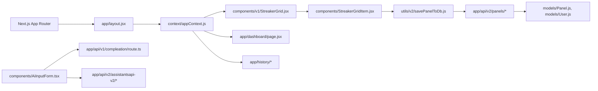

# 1. Repository Map

## 1.1 Top-Level Structure
- `app/`: Next.js App Router pages, layouts, route handlers (API).
- `components/`: React components (UI, layout, grid, AI flows, PWA helpers).
- `context/`: React context for global app state.
- `hooks/`: Client hooks (toast).
- `lib/`: Shared utilities (tailwind + class helpers).
- `middleware/`: MongoDB middleware (next-connect) duplicate of `utils/middleware.js`.
- `models/`: Mongoose schemas for User/Panel/Board/Cell.
- `prisma/`: Prisma schema (sqlite) with a single `Item` model; not referenced in code.
- `public/`: Static assets, PWA manifest, service worker, screenshots, media.
- `styles/`: CSS modules for grid, dashboard, etc.
- `utils/`: DB connection, board helpers, OpenAI, v2 panel APIs, and misc helpers.
- `.next/`: Build output (generated).
- `node_modules/`: Dependencies (generated).

## 1.2 Entry Points
- Web app entry: `app/layout.jsx`, `app/page.jsx`.
- Main tracking surface: `app/panel/page.jsx`, `components/v1/StreakerGrid.jsx`.
- AI goal generation: `app/generategoals/page.jsx`, `components/AiInputForm.tsx`.
- Suggestions surface: `app/suggestions/page.js`, `components/GenerateStreakerBoardButton.jsx`.
- Dashboard: `app/dashboard/page.jsx`.
- History: `app/history/page.tsx`, `app/history/[id]/page.jsx`, `app/history/dashboard/page.jsx`.
- API entry points: `app/api/**/route.*`.
- PWA: `next.config.js`, `public/manifest.json`, `public/sw.js`.

## 1.3 API Routes Map (App Router)
### Auth
- `app/api/auth/[kindeAuth]/route.ts` (Kinde auth callback handler).

### V1 (boards, streaming completions)
- `app/api/v1/boards/route.js` (GET all boards, POST update board by `boardUser` only).
- `app/api/v1/boards/createboard/route.js` (POST create board if none exists).
- `app/api/v1/boards/updatecell/route.js` (POST update a single cell by index).
- `app/api/v1/boards/updategoaltoachieve/route.js` (POST update goal string).
- `app/api/v1/boards/updatehabitsnames/route.js` (POST update habit names array).
- `app/api/v1/boards/updatehabitsvalues/route.js` (POST update habit values array).
- `app/api/v1/boards/updatename/route.js` (POST update goal string; duplicate path intent).
- `app/api/v1/users/getuser/route.js` (GET current user from Kinde session).
- `app/api/v1/userboards/route.js` (POST get most recent user panel).
- `app/api/v1/compleation/route.ts` (POST streaming OpenAI completion on edge runtime).
- `app/api/v1/simplecompleation/route.js` (POST non-stream OpenAI completion).

### V2 (panels + assistants API)
- `app/api/v2/panels/route.js` (GET all panels).
- `app/api/v2/panels/[id]/route.js` (GET panel by id).
- `app/api/v2/panels/create/route.js` (POST create panel for auth user).
- `app/api/v2/panels/update/route.js` (POST update a panel).
- `app/api/v2/panels/checkpanel/route.js` (POST check panel by id).
- `app/api/v2/upload-screenshot/route.js` (POST save base64 PNG to `public/screenshots/currentScreenshot.png`).
- `app/api/v2/assistantsapi-v2/thread/createThread/route.js` (GET create Assistants thread).
- `app/api/v2/assistantsapi-v2/message/createMessageNew/route.js` (POST create thread message).
- `app/api/v2/assistantsapi-v2/message/listMessages/route.js` (POST list messages).
- `app/api/v2/assistantsapi-v2/run/runAssistant/route.js` (POST run assistant).
- `app/api/v2/assistantsapi-v2/run/getRun/route.js` (POST poll run + return messages).
- `app/api/v2/assistantsapi-v2/assistant/getAssistant/route.js` (GET assistant metadata).

# 2. Architecture Overview

## 2.1 System Architecture
- Frontend: Next.js 14 App Router with client components, Tailwind, Radix UI, Shadcn-based UI components, Framer Motion animations.
- Backend: Next.js route handlers under `app/api` serving JSON.
- Auth: Kinde (`@kinde-oss/kinde-auth-nextjs`) for auth flows and session.
- Data: MongoDB via Mongoose (`utils/db.js`, `models/*`).
- AI: OpenAI chat completions (v1) and OpenAI Assistants API (v2).
- Analytics: PostHog (`app/providers.js`), Vercel Analytics (`@vercel/analytics`).
- PWA: `next-pwa` builds service worker to `public/`.

## 2.2 Runtime Topology
- Server runtime: Node.js (Next.js server + API handlers), plus Edge runtime for `app/api/v1/compleation/route.ts`.
- Client runtime: React 18, client components with Kinde browser client.
- PWA caching service worker (generated) in `public/sw.js`.

## 2.3 Data Flow (Primary Use Case)
1) User logs in via Kinde.
2) `app/api/auth/[kindeAuth]/route.ts` creates a user if missing.
3) UI loads board from `/api/v1/userboards` (`utils/getCurrentUserBoardFromDb.js`).
4) User interacts with grid; client updates AppContext state.
5) Save action calls `/api/v2/panels/update` via `utils/v2/savePanelToDb.js`.
6) Mongoose persists panel + history in MongoDB.

## 2.4 Dependency Graph (Major Modules)

# 3. Core Domains & Business Logic

## 3.1 Users
- Model: `models/User.js` (email, name, image, panels[] refs).
- Created in `app/api/auth/[kindeAuth]/route.ts` on Kinde callback.
- Invariants: `email` unique and required; `name` required.
- Edge cases:
  - User creation uses `role` field not in schema, so it is discarded by Mongoose (strict mode). See `app/api/auth/[kindeAuth]/route.ts`.
  - `app/api/v1/users/getuser/route.js` uses a fallback hard-coded email when `user.email` missing.

## 3.2 Panels (V2)
- Model: `models/Panel.js` with nested `History` and `Cell` subdocuments.
- Fields: `goalToAchieve`, `habitsNames`, `habitsValues`, `days`, `history[]`, `cells[]`, `user` ref.
- Create: `app/api/v2/panels/create/route.js` (auth required).
- Update: `app/api/v2/panels/update/route.js` (upsert by `_id`).
- History maintenance: `utils/v2/savePanelToDb.js` builds monthly history entries.
- Invariants/constraints:
  - `habitsNames`/`habitsValues` required on panel creation.
  - `days` required.
- Edge cases:
  - `utils/v2/createPanelInDb.js` references `history` variable that is undefined.
  - `utils/v2/savePanelToDb.js` checks `checkPanelExists` without awaiting it, and compares for `201` though API returns `200`.

## 3.3 Boards (V1, legacy)
- Model: `models/board.js` and `models/StreakerBoard.js` (same structure).
- Fields: `boardId`, `goalToAchieve`, `habitsNames`, `habitsValues`, `days`, `cells`, `boardUser`.
- API: `app/api/v1/boards/*` and `app/api/v1/userboards/route.js`.
- Invariants/constraints:
  - `boardId` unique.
  - `cells` stored as array; updates by index in `updatecell` route.
- Edge cases:
  - `app/api/v1/boards/route.js` POST refuses creation and returns `BLOCKED FOR TESTING`.
  - `app/api/v1/boards/updatehabitsvalues/route.js` destructures `habitsNames` into `habitsValues` by mistake.

## 3.4 Habits, Streaks, and Cells
- Cell shape derived from `models/Panel.js` and `utils/generateEmptyBoardCells.js`:
  - `id`, `rowNr`, `colNr`, `isDone`, `isClear`, `comment`, `label`.
- Cell state transitions live in `components/StreakerGridItem.jsx`:
  - Single click toggles done/clear.
  - Double click clears (resets to clear).
  - Long press opens note editor.
- Invariants:
  - `id` is `${rowNr}-${colNr}`.
  - Future dates are blocked from toggling (check by current date).

## 3.5 History
- Stored in `Panel.history[]` (monthly snapshots).
- History UI in `app/history/*` and `components/v1/StreakerHistoryGrid.tsx`.
- `HistoryList` filters out current month entries by name (not year-aware).

## 3.6 AI Coaching
- Prompt: `utils/openai/prompt.js` defines system instruction and format.
- V1 Completion (streaming): `app/api/v1/compleation/route.ts` using `openai-edge`.
- V1 Completion (non-stream): `app/api/v1/simplecompleation/route.js` using `openai` SDK.
- V2 Assistants: `utils/openai-v2/openAiFunctions.js` + route handlers under `app/api/v2/assistantsapi-v2/*`.

# 4. API & Contracts

## 4.1 Auth
- `GET /api/auth/:kindeAuth`
  - Behavior: delegates to Kinde `handleAuth`, and creates user record if missing.
  - File: `app/api/auth/[kindeAuth]/route.ts`.

## 4.2 Boards (V1)
- `GET /api/v1/boards`
  - Response: list of boards.
  - File: `app/api/v1/boards/route.js`.
- `POST /api/v1/boards`
  - Request: `{ boardUser, goalToAchieve, habitsNames, habitsValues, days, cells }`.
  - Behavior: update existing board by `boardUser`, otherwise returns 404 `BLOCKED FOR TESTING`.
  - File: `app/api/v1/boards/route.js`.
- `POST /api/v1/boards/createboard`
  - Request: `{ boardUser, ...boardDetails }`.
  - Response: 201 and new board or 400 if exists.
  - File: `app/api/v1/boards/createboard/route.js`.
- `POST /api/v1/boards/updatecell`
  - Request: `{ _id, currentCellIndex, updatedCell }`.
  - Response: 201 with updated board (not serialized in body).
  - File: `app/api/v1/boards/updatecell/route.js`.
- `POST /api/v1/boards/updategoaltoachieve`
  - Request: `{ _id, goalToAchieve }`.
  - File: `app/api/v1/boards/updategoaltoachieve/route.js`.
- `POST /api/v1/boards/updatehabitsnames`
  - Request: `{ _id, habitsNames }`.
  - File: `app/api/v1/boards/updatehabitsnames/route.js`.
- `POST /api/v1/boards/updatehabitsvalues`
  - Request: `{ _id, habitsValues }` but code reads `habitsNames`.
  - File: `app/api/v1/boards/updatehabitsvalues/route.js`.
- `POST /api/v1/boards/updatename`
  - Request: `{ _id, goalToAchieve }`.
  - File: `app/api/v1/boards/updatename/route.js`.
- `POST /api/v1/userboards`
  - Request: `{ boardUser }`.
  - Behavior: finds user by email, takes last panel id, then loads panel.
  - File: `app/api/v1/userboards/route.js`.

## 4.3 Panels (V2)
- `GET /api/v2/panels`
  - Response: list of panels.
  - File: `app/api/v2/panels/route.js`.
- `GET /api/v2/panels/:id`
  - Response: panel JSON or 404.
  - File: `app/api/v2/panels/[id]/route.js`.
- `POST /api/v2/panels/create`
  - Request: `{ goalToAchieve, habitsNames, habitsValues, days, history, cells }`.
  - Auth: requires Kinde user.
  - File: `app/api/v2/panels/create/route.js`.
- `POST /api/v2/panels/update`
  - Request: `{ _id, cells, goalToAchieve, habitsNames, habitsValues, days, history, user }`.
  - File: `app/api/v2/panels/update/route.js`.
- `POST /api/v2/panels/checkpanel`
  - Request: `{ panelId }`.
  - Response: array of matching panel(s).
  - File: `app/api/v2/panels/checkpanel/route.js`.

## 4.4 AI
- `POST /api/v1/compleation` (Edge)
  - Request: `{ message: { goal } }`.
  - Response: streaming text via `OpenAIStream`.
  - File: `app/api/v1/compleation/route.ts`.
- `POST /api/v1/simplecompleation`
  - Request: `{ message: { goal } }`.
  - Response: full completion.
  - File: `app/api/v1/simplecompleation/route.js`.
- V2 Assistants endpoints map to OpenAI Assistants API:
  - `GET /api/v2/assistantsapi-v2/thread/createThread`
  - `POST /api/v2/assistantsapi-v2/message/createMessageNew`
  - `POST /api/v2/assistantsapi-v2/message/listMessages`
  - `POST /api/v2/assistantsapi-v2/run/runAssistant`
  - `POST /api/v2/assistantsapi-v2/run/getRun`
  - `GET /api/v2/assistantsapi-v2/assistant/getAssistant`
  - Files under `app/api/v2/assistantsapi-v2/*`.

## 4.5 Uploads
- `POST /api/v2/upload-screenshot`
  - Request: `{ image: "data:image/png;base64,..." }`.
  - Writes file to `public/screenshots/currentScreenshot.png`.
  - File: `app/api/v2/upload-screenshot/route.js`.

## 4.6 Auth & Rate Limits
- No explicit rate limiting or quotas in code.
- Auth enforced only on panel creation (V2) via Kinde.

# 5. Persistence Layer

## 5.1 MongoDB (Mongoose)
- Connection: `utils/db.js` (env `MONGO_DB_URL`).
- Schemas:
  - `models/User.js`
  - `models/Panel.js`
  - `models/Cell.js`
  - `models/board.js`, `models/StreakerBoard.js` (legacy).
- Indexes:
  - `User.email` unique.
  - `Board.boardId` unique.
- Migrations: none in repo.

## 5.2 Prisma (Unused)
- `prisma/schema.prisma` defines sqlite datasource with `Item` model.
- No code references to Prisma client.

## 5.3 Caching / Consistency
- No explicit caching layer.
- Some fetch calls set `cache: "no-cache"` or `revalidate: 0`.

## 5.4 Backups / Recovery
- No backup strategy defined in code.

# 6. AI & Automation Layer

## 6.1 Prompt Pipelines
- System prompt: `utils/openai/prompt.js`.
- V1 streaming completion uses model `gpt-4o` in `app/api/v1/compleation/route.ts`.
- V1 non-stream uses model `gpt-4o` in `app/api/v1/simplecompleation/route.js`.
- V2 Assistants uses assistant id from env in `utils/openai-v2/openAiFunctions.js`.

## 6.2 Tool Calls / Memory / Embeddings
- No tool calls, vector stores, or embeddings in code.

## 6.3 Determinism / Latency
- Responses are stochastic (OpenAI completions).
- Potential latency hotspots: Assistants run polling and streaming edge endpoint.

# 7. Frontend System

## 7.1 Routes and Layouts
- Layout: `app/layout.jsx` wraps `MainLayout` and `AppContextProvider`.
- Pages:
  - `/` intro: `app/page.jsx` -> `components/v1/NewIntro.jsx`.
  - `/generategoals`: `app/generategoals/page.jsx`.
  - `/suggestions`: `app/suggestions/page.js`.
  - `/panel`: `app/panel/page.jsx`.
  - `/panel/[id]`: `app/panel/[id]/page.jsx`.
  - `/board`: `app/board/page.js`.
  - `/dashboard`: `app/dashboard/page.jsx`.
  - `/stats`: `app/stats/page.jsx`.
  - `/history`: `app/history/page.tsx` + `app/history/[id]/page.jsx`.
  - `/history/dashboard`: `app/history/dashboard/page.jsx`.
  - `/about`: `app/about/page.tsx`.
  - `/install`: `app/install/page.jsx`.

## 7.2 State Management
- Global state in `context/appContext.js`.
- Board + history maintained in context, manipulated by grid components.

## 7.3 Data Fetching
- Client fetch to Next API routes (no SWR/React Query).
- `getCurrentUserBoardFromDb` calls `/api/v1/userboards`.
- `savePanelToDb` calls `/api/v2/panels/update`.

## 7.4 Component Hierarchy (Core)
- `MainLayout` -> `Header` / `Footer` -> pages -> `StreakerGrid` -> `StreakerGridRow` -> `StreakerGridItem`.
- History pages use `HistoryList` and `StreakerHistoryGrid`.

## 7.5 Accessibility & Performance
- Uses dialog/toast from Radix/Shadcn.
- No explicit a11y testing or performance budget in repo.

# 8. Security & Privacy Audit

## 8.1 Auth Flows
- Kinde server session for API auth (`app/api/auth/[kindeAuth]/route.ts`, `app/api/v2/panels/create/route.js`).
- Client uses Kinde browser client for UI gating.

## 8.2 Token Handling / Secrets
- OpenAI key used on server in `app/api/v1/compleation/route.ts`.
- `NEXT_PUBLIC_OPENAI_API_KEY` is used server-side in `app/api/v1/simplecompleation/route.js` and client-side in `utils/openai/createCompleation.js` with `dangerouslyAllowBrowser`, which exposes key in browser bundles.
- PostHog keys (`NEXT_PUBLIC_POSTHOG_KEY`, `NEXT_PUBLIC_POSTHOG_HOST`) exposed in client.

## 8.3 PII Handling
- User email and name stored in MongoDB (`models/User.js`).
- No explicit data retention or deletion paths.

## 8.4 OWASP Top 10 Considerations
- No rate limiting or abuse protection on AI endpoints.
- No CSRF protection on POST routes.
- Upload endpoint writes files directly to `public/` without auth.
- Some API routes log request data to console.

# 9. DevOps & Runtime

## 9.1 Environment Setup
- Next.js scripts: `npm run dev`, `npm run build`, `npm run start`, `npm run lint` (`package.json`).
- Environment variables used across code:
  - `OPENAI_API_KEY`, `NEXT_PUBLIC_OPENAI_API_KEY`, `ASSISTANT_ID`.
  - `OPENAI_API_STREAKER_AI_ORG_ID`, `OPENAI_API_PROJECT_ID`.
  - `MONGO_DB_URL`, `MONGO_DB_CONNECTIONSTRING`, `MONGO_DB_NAME`.
  - `NEXT_PUBLIC_API_DOMAIN`, `NEXT_PUBLIC_ALLOWED_USERS`.
  - `NEXT_PUBLIC_POSTHOG_KEY`, `NEXT_PUBLIC_POSTHOG_HOST`.

## 9.2 Build / CI / CD
- No CI/CD configuration present in repo.

## 9.3 Hosting Topology
- Designed for Next.js hosting (likely Vercel). PWA enabled via `next-pwa` in `next.config.js`.

## 9.4 Observability
- PostHog client analytics in `app/providers.js`.
- Console logging across API and UI.

# 10. Known Risks & Technical Debt

## P0 / High Risk
- OpenAI API key exposed to the browser via `NEXT_PUBLIC_OPENAI_API_KEY` and `dangerouslyAllowBrowser` (`utils/openai/createCompleation.js`).
- Assistants OpenAI config uses `process.OPENAI_API_STREAKER_AI_ORG_ID` and `process.OPENAI_API_PROJECT_ID` (missing `.env` namespace), likely undefined at runtime (`utils/openai-v2/openAiFunctions.js`).
- `savePanelToDb` does not `await` `checkPanelExists`, and compares for `201` while API returns `200`, causing update logic to be unreliable (`utils/v2/savePanelToDb.js`, `app/api/v2/panels/checkpanel/route.js`).
- `createPanelInDb` references undefined `history` (`utils/v2/createPanelInDb.js`).

## P1 / Medium Risk
- V1 board API POST is blocked from creating data and always returns 404 when board is missing (`app/api/v1/boards/route.js`).
- `app/api/v1/boards/updatehabitsvalues/route.js` reads `habitsNames` instead of `habitsValues`.
- `app/api/v2/assistantsapi-v2/message/createMessage.js/route.js` uses `req.body` instead of `await req.json()`.
- `app/api/v1/userboards/route.js` expects `panels[]. _id` even though panels are stored as ObjectIds.

## P2 / Low Risk / Maintainability
- Duplicate models: `models/board.js` and `models/StreakerBoard.js` are identical.
- Prisma schema unused alongside Mongoose (possible partial migration).
- Duplicate middleware (`middleware/database.js` and `utils/middleware.js`).
- `components/StreakerGrid.jsx` references `getDaysInMonth` without import and appears unused.

# 11. Refactoring & Hardening Roadmap

## P0 Critical Fixes
1) Move all OpenAI calls server-side, remove `dangerouslyAllowBrowser`, and replace `NEXT_PUBLIC_OPENAI_API_KEY` usage on server.
2) Fix Assistants config env variable usage to `process.env.*`.
3) Fix `savePanelToDb` async flow: await `checkPanelExists`, align status codes, and handle create vs update properly.
4) Fix `createPanelInDb` to pass `panel.history` or computed history.

## P1 Structural Improvements
1) Consolidate V1 Boards and V2 Panels (single model + API surface).
2) Normalize history handling and make year/month filtering consistent.
3) Remove duplicate board models and unused Prisma schema if not needed.
4) Enforce auth on write endpoints (board/panel updates, screenshot upload).

## P2 Optimization Opportunities
1) Add data validation on API routes using Zod schemas.
2) Introduce caching for panel fetches to reduce redundant reads.
3) Reduce client logs and enable structured server logging.

## P3 Future-Proofing
1) Add migrations/seed strategy if schema evolves.
2) Add CI and automated tests for API handlers and grid state transitions.
3) Introduce rate limiting for AI endpoints.

---

## Reference Index (Key Files)
- `app/layout.jsx`
- `app/page.jsx`
- `app/api/auth/[kindeAuth]/route.ts`
- `app/api/v1/*`
- `app/api/v2/*`
- `components/v1/StreakerGrid.jsx`
- `components/StreakerGridItem.jsx`
- `components/AiInputForm.tsx`
- `context/appContext.js`
- `models/Panel.js`
- `models/User.js`
- `utils/db.js`
- `utils/v2/savePanelToDb.js`
- `utils/openai/prompt.js`
- `utils/openai-v2/openAiFunctions.js`
